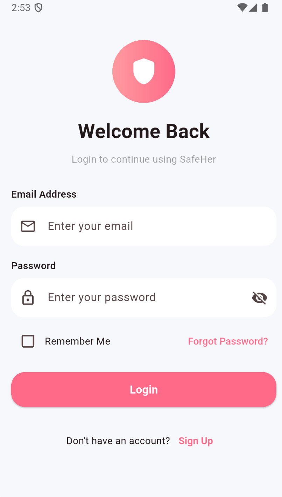
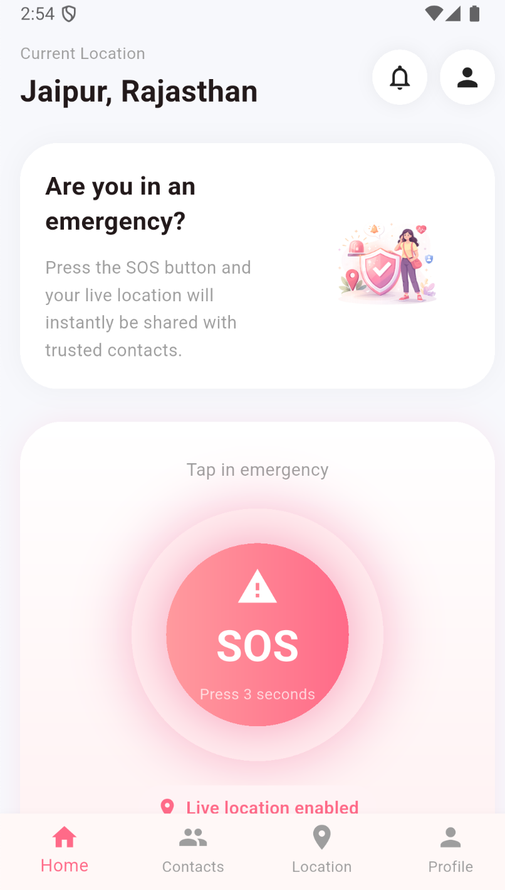
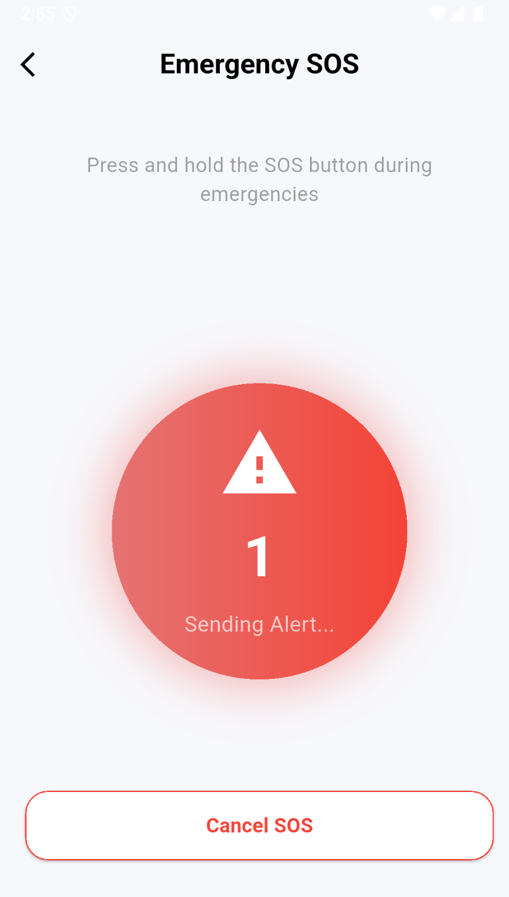
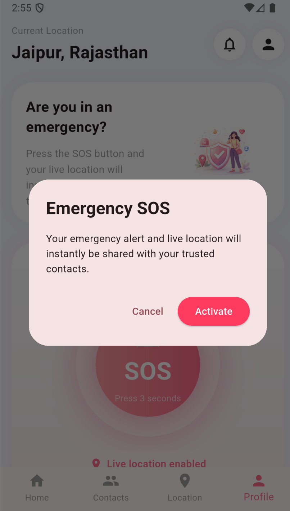
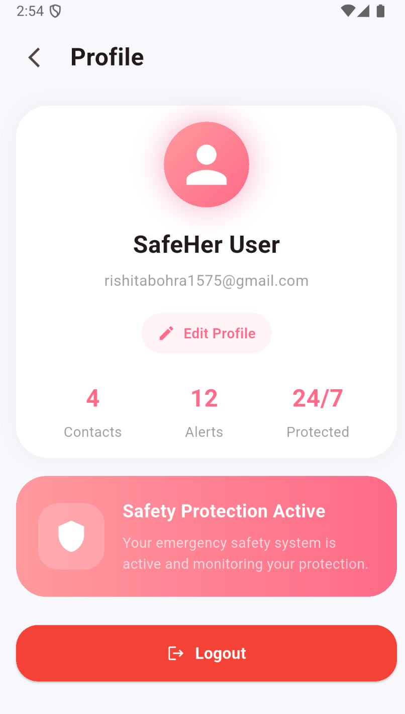

# SafeHer – Women Safety App

SafeHer is a Flutter-based women safety application designed to provide quick emergency assistance, live location tracking, and SOS alert functionality using Firebase and Google Maps.

## Features

* Firebase Authentication (Login / Signup)
* Firestore Database Integration
* SOS Emergency Alert System
* Live GPS Location Tracking
* Google Maps Integration
* Emergency Contacts Management
* Modern Responsive UI
* Profile Management
* Real-Time Emergency Data Storage

## Tech Stack

### Frontend

* Flutter
* Dart

### Backend & Services

* Firebase Authentication
* Cloud Firestore
* Google Maps API
* Geolocator

## Project Structure

```bash
lib/
├── screens/
│   ├── auth/
│   ├── contacts/
│   ├── home/
│   ├── maps/
│   ├── profile/
│   └── sos/
├── widgets/
├── services/
└── main.dart
```

## App Screenshots


<p align="center">
  
  
  
</p>

<p align="center">
  
  
  
</p>

## Screens Included

* Splash Screen
* Login Screen
* Signup Screen
* Home Screen
* SOS Active Screen
* Emergency Contacts Screen
* Live Location Screen
* Profile Screen

## Firebase Features

### Authentication

* User Signup
* User Login
* Persistent Sessions

### Firestore

* User Data Storage
* SOS Alert Storage
* Emergency Contact Storage

## Google Maps Features

* Current User Location
* Real-Time GPS Tracking
* Location Marker
* Live Map Interface

## SOS System

When the SOS button is activated:

* User live location is fetched
* Alert is stored in Firestore
* Emergency status becomes active
* Timestamp and coordinates are saved

## Installation

### Clone Repository

```bash
git clone https://github.com/YOUR_USERNAME/safeher-women-safety-app.git
cd safeher-women-safety-app
```

### Install Dependencies

```bash
flutter pub get
```

### Run App

```bash
flutter run
```

## Firebase Setup

1. Create Firebase project
2. Enable Authentication
3. Enable Firestore Database
4. Add Android app
5. Download `google-services.json`
6. Place it inside:

```bash
android/app/
```

## Google Maps Setup

1. Enable Maps SDK for Android
2. Generate API key
3. Add API key inside:

```xml
android/app/src/main/AndroidManifest.xml
```

## Future Improvements

* Push Notifications
* SMS Alerts
* Voice Activated SOS
* Nearby Police/Hospital Detection
* AI Safety Assistant
* Route Safety Prediction

## Author

Rishita Bohra

## License

This project is built for educational and portfolio purposes.
